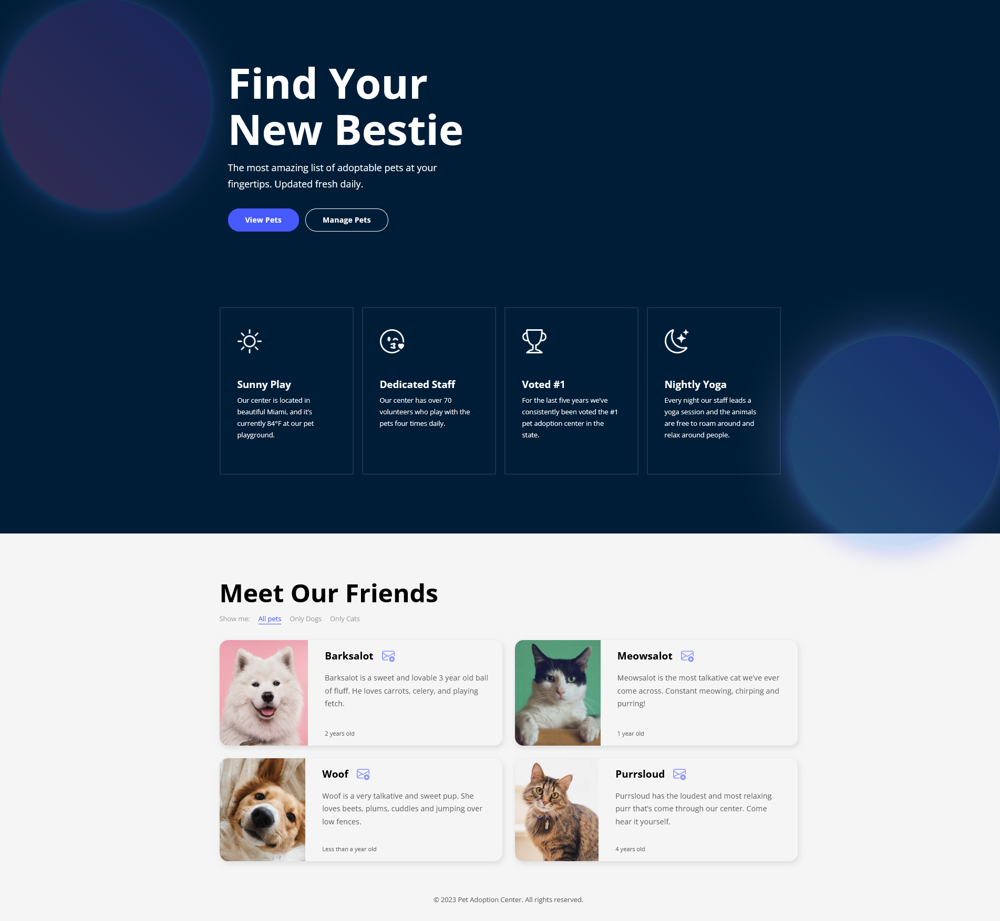
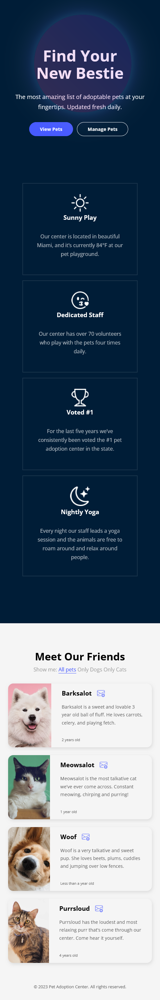

# 🐾 Pet Adoption Website

Welcome to the **Pet Adoption Website**! This project is designed to help potential pet owners connect with animals in need of a loving home. Built with **HTML** and **CSS**, it provides a user-friendly and visually appealing platform.

---

## 🚀 Features

- 🐕 **Homepage**: Highlighted pets and introduction to the adoption process.
- 🐾 **Pet Profiles**: Detailed pages for each adoptable pet, including images, breed, age, and temperament.
- 📱 **Responsive Design**: Optimized for mobile, tablet, and desktop.

---

## 🛠️ Technologies Used

- **HTML5**: Semantic structure of the website.
- **CSS3**: Styling and layout, with a focus on user experience.

---

## 🎨 Design Highlights

- **Clean and Modern Layout**: Easy navigation and readability.
- **Engaging Visuals**: High-quality images of pets to attract potential adopters.
- **Accessibility**: Focused on creating an inclusive experience for all users.

---

## 📸 Screenshots

### Homepage

  
_The homepage features a welcoming layout with highlighted pets and quick navigation to essential sections._

### Responsive Design

  
_Optimized for various screen sizes, ensuring a seamless user experience on mobile and desktop._

---

## 🌐 Live Preview

You can view the live website here:  
👉 [Pet Adoption Website Live Preview](https://merry-scone-a43344.netlify.app)
